# Results

**Hybrid Stock Forecasting: Grounding a Large Language Model with Retrieval, and Combining It with an LSTM**  
Mukesh Mukkara · x24226432 · National College of Ireland

Every number and figure in this document comes from the rest of `outputs/`, which is written by `research.ipynb`. Nothing here is typed by hand, so no figure in this report can disagree with the pipeline that produced it.

---

## 1. What was evaluated

| Design choice | Setting |
| --- | --- |
| Stocks | NVDA, AAPL, TSLA, JPM, MSFT |
| Period | 2019-01-01 to 2024-12-31 |
| Task | direction of the close 5 trading days ahead |
| Holdout | 300 predictions across 60 dates (190 calm, 110 shock) |
| Split | chronological by date; the tuning dates are never reported on |
| Regime | SHOCK when VIX > 25, else CALM |
| Model | gemini-2.5-flash at temperature 0.0 |
| Retrieval | TF-IDF cosine, top-4, 90-day window, nothing dated after the query |

---

## 2. The data

Three later choices are only defensible if the data is described first, so this section is what they point back to.

| Stock | Days | Total return | Ann. volatility | Max drawdown | Up days | Up after 5 days | Avg volume |
| --- | --- | --- | --- | --- | --- | --- | --- |
| NVDA | 1509 | 3970.1% | 51.9% | -66.3% | 54.64% | **58.84%** | 448.6M |
| AAPL | 1509 | 568.8% | 30.8% | -31.4% | 54.18% | **59.25%** | 94.2M |
| TSLA | 1509 | 1918.9% | 64.5% | -73.6% | 53.05% | **54.11%** | 127.5M |
| JPM | 1509 | 187.1% | 30.7% | -43.6% | 52.59% | **56.51%** | 12.9M |
| MSFT | 1509 | 345.7% | 29.0% | -37.1% | 53.91% | **58.97%** | 28.0M |

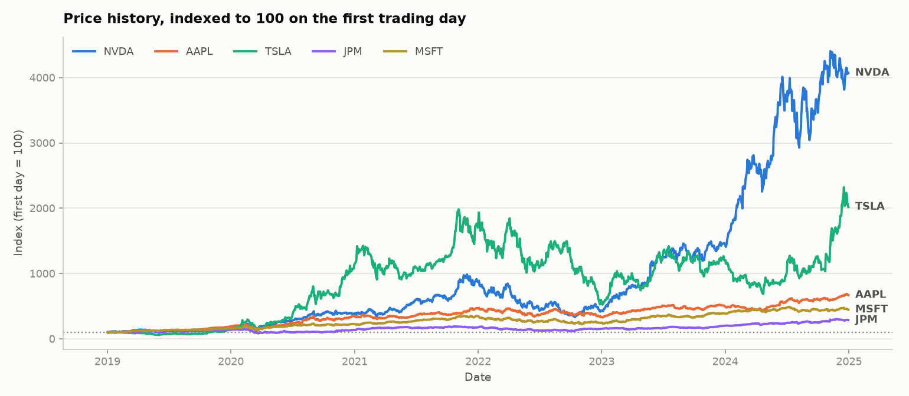

**Why the label is direction, not price.** The return distributions are near-symmetric and centred on roughly zero, so a level forecast would be dominated by the level itself rather than by anything a model learned. Predicting the sign of the 5-day change is the harder and more honest task.

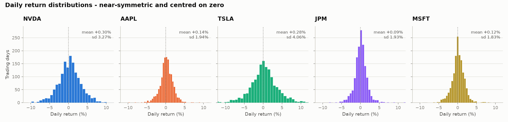

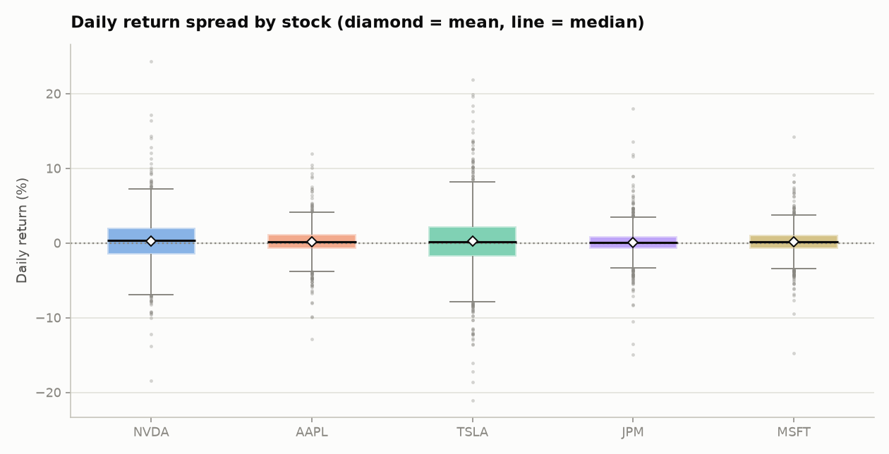

**Why the baseline is not 50%.** The `Up after 5 days` column is the always-UP rate: over this period these five stocks rose more often than they fell, so a model that learns nothing and always says UP already scores well above a coin flip. Every accuracy in this report is judged against that rate *for the regime in question*, never against 50%.

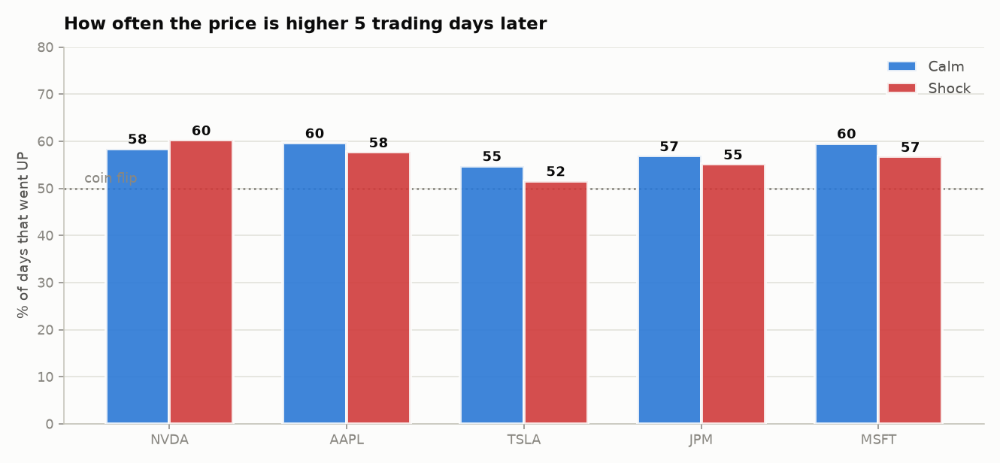

**Why everything is split by regime.** The volatility panel shows the shock periods are visibly a different market rather than an arbitrary cut of one population. The VIX is published on the day itself, so labelling a date this way uses no information from the future.

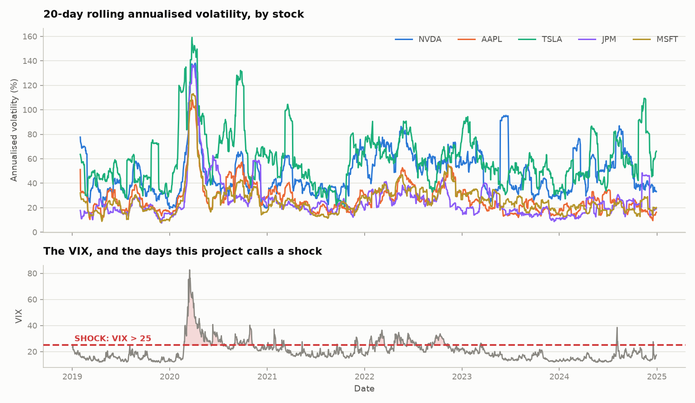

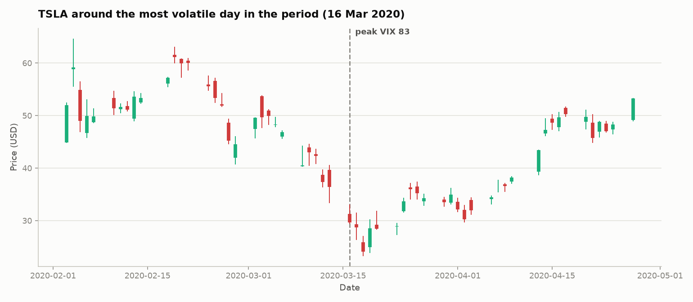

**Why the five stocks are pooled into one model.** Daily returns correlate far less than price levels do, so the five series carry partly independent information while sharing a common scale - which is what makes pooling them into a single model legitimate rather than a convenience.

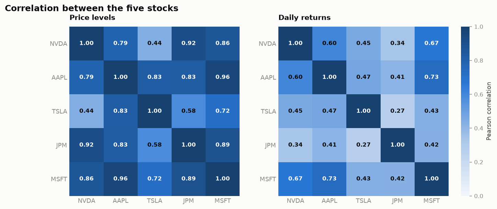

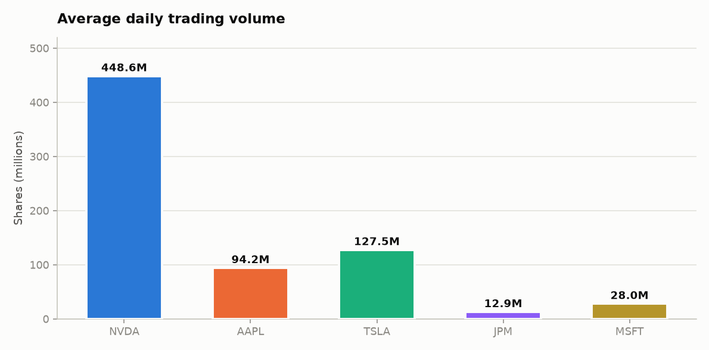

---

## 3. Model selection: classical ML against deep learning

The rest of this report treats the ML arm as an LSTM. That is only defensible if the alternatives were tried on the same task, so they were. Every model below sees the same walk-forward folds, the same 5-day embargo, the same features, and gets its own decision threshold tuned on that fold's validation slice and never on test.

| Model | Family | Overall | Calm | Shock | F1 | AUC | Brier |
| --- | --- | --- | --- | --- | --- | --- | --- |
| Logistic Regression | Classical ML | 53.13% | 53.42% | 51.67% | 66.74 | 51.07 | 0.2536 |
| Random Forest | Classical ML | 52.17% | 52.76% | 49.17% | 60.21 | 50.79 | 0.2543 |
| XGBoost | Classical ML | 52.9% | 53.77% | 48.47% | 64.56 | 50.91 | 0.273 |
| GRU | Deep learning | 54.75% | 54.64% | 55.28% | 66.62 | 50.2 | 0.2561 |
| LSTM | Deep learning | 53.84% | 53.96% | 53.19% | 66.15 | 50.04 | 0.2561 |
| *Baseline: always UP* | Baseline | 54.98% | 55.38% | 52.92% | 70.95 | 50.0 | 0.2475 |

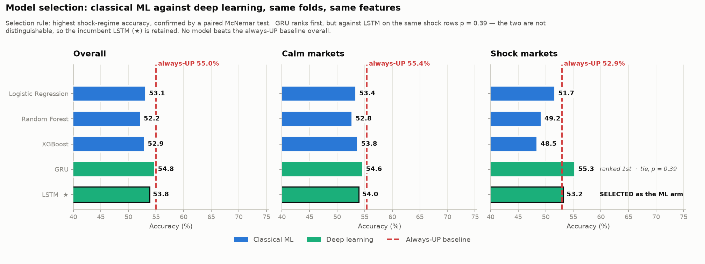

### What the comparison supports

**Sequence models beat classical ones when the market breaks.** In shocks the two deep-learning models average **54.23%** against **49.77%** for the three classical models - a 4.5-point gap, and the only difference in this table large enough to mean anything. Every classical model lands at or below the always-UP rate in shocks; both sequence models land above it. That is the result this stage exists to establish, and it is why the ML arm is a recurrent network.

**Which recurrent network is a coin flip.** GRU ranks first on shock accuracy, but the paired McNemar test against LSTM on the same shock rows gives **p = 0.39**. The two are not distinguishable on this sample.

**Selected: LSTM.** The incumbent is retained: the reported pipeline is built and validated on it, and swapping architectures on a gap this far from significance would be fitting the sample rather than choosing a model - the same over-fitting this project refuses in §10 when it shrinks the fusion weight towards an equal blend. `model_selection.json` records the full ranking, the test, and this reasoning.

**No model here beats the always-UP baseline overall** (54.98% on these rows), and every AUC sits between 50.0 and 51.1 - which is to say none of the five ranks days better than chance. Reported rather than hidden, and it is the measurement that motivates the rest of the project: if no amount of architecture search on price history clears the baseline, the remaining question is whether a different *kind* of information helps.

The classical models read one engineered feature row per day; the sequence models read a 60-day window. That is the comparison rather than a handicap - the features are already backward-looking, so what the sequence models add is the *shape* of those 60 days. Flattening the window instead would hand the classical models 1,320 columns on roughly 4,000 rows, which would measure overfitting rather than architecture.

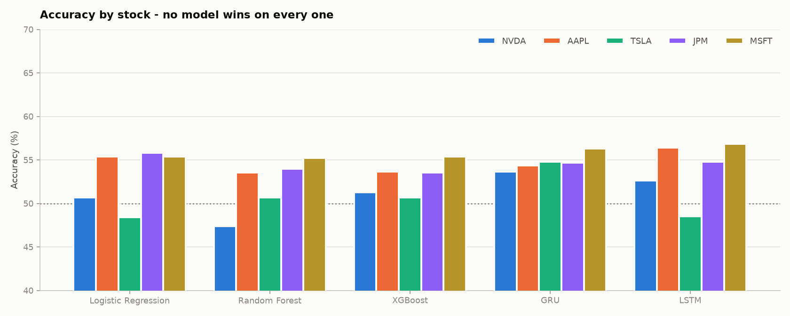

No model wins on every stock. On a task this noisy that is expected, and it is the reason the selection above rests on a family-level gap and a significance test rather than on which bar happens to be tallest.

---

## 4. Headline: direction accuracy

| System | Overall | Calm | Shock | 95% CI | Brier (raw) | Brier (calibrated) |
| --- | --- | --- | --- | --- | --- | --- |
| Hybrid (ML + RAG-LLM) | 58.33% | 57.89% | 59.09% | [52.33, 64.67] | 0.2447 | 0.2447 |
| LLM + RAG (grounded) | 57.67% | 56.32% | 60.0% | [51.0, 64.33] | 0.2446 | 0.2505 |
| LLM only (no evidence) | 56.0% | 55.79% | 56.36% | [49.66, 62.67] | 0.2517 | 0.2509 |
| ML only (LSTM) | 52.67% | 55.79% | 47.27% | [46.33, 59.33] | 0.2542 | 0.2507 |
| *Baseline: always UP* | *54.33%* | *54.21%* | *54.55%* | — | — | — |

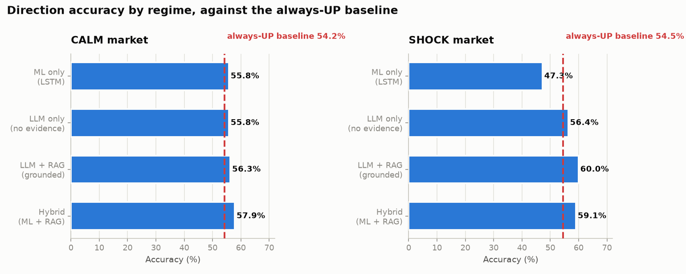

The **Brier (calibrated)** column re-centres every arm on its own tuned threshold before scoring — the same transform the Hybrid is built on. Applying it to all four is what makes the calibration comparison like-for-like rather than a free gift to the Hybrid. The raw column is the probability each arm actually emitted.

**Hybrid (ML + RAG-LLM) is the top arm at 58.33%**, and is the best calibrated on the like-for-like measure (0.2447 against 0.2505 for LLM + RAG (grounded)).

On the **raw** Brier column the two swap by a hair — 0.2446 for the grounded LLM against 0.2447 for the Hybrid. That column is not a fair comparison, because the Hybrid's probability is expressed relative to a decision point and the single arms' are not; it is printed so the untransformed numbers are on the record rather than hidden. The calibrated column is the one to read.

### What each layer contributed

The four arms are not four unrelated systems. Each is the one below it plus exactly one layer, so the table above is a ladder. But four accuracies cannot say the layers *caused* the ordering: a layer that fixes 40 rows and breaks 40 lands in the same place as one that does nothing. Only the rows where two arms disagree carry that information — the same argument that makes McNemar the right test in §6.

| Layer added | Rows fixed | Rows broken | Rows changed | Net | Accuracy |
| --- | --- | --- | --- | --- | --- |
| Language reasoning (ML → LLM) | 63 | 53 | 116 | **+10** | +3.33 pts |
| Retrieved evidence (LLM → LLM+RAG) | 45 | 40 | 85 | **+5** | +1.67 pts |
| Calibrated fusion (LLM+RAG → Hybrid) | 25 | 23 | 48 | **+2** | +0.67 pts |

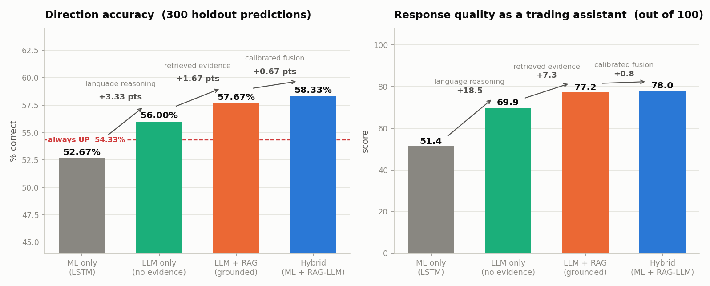

**Every layer nets positive**, so the ordering is earned rather than an artefact of the totals — and the same ordering appears again in §9 on a rubric that shares no inputs with this table, spread over 26.6 points instead of 5.66.

Two things qualify it. Each layer does far more work than its net suggests: retrieval alters **85 of 300** rows to gain five, so a layer can be influential and only marginally beneficial. And the pattern is a tendency, not a property of any row — every layer helped on **22** rows and every layer hurt on **19**.

### The honest reading of that table

Every confidence interval above overlaps every other one, and the Hybrid's lead over the grounded LLM has p = 0.89 on a paired McNemar test. **This project does not demonstrate a system that predicts the stock market.** It demonstrates that four systems can be compared fairly, and shows what each engineering layer adds and what it costs.

---

## 5. How high this task can go

Because the accuracies above are close to the baselines, the natural question is whether more engineering would lift them. These bounds answer it — the last two rows are deliberately unfair, and are computed by fitting on the test set:

| Bound on the same 300 holdout rows | Accuracy | Legitimate? |
| --- | --- | --- |
| Always predict DOWN | 45.67% | baseline |
| Always predict UP | 54.33% | baseline |
| **Reported hybrid** (weights + thresholds from the tuning split) | **58.33%** | **yes — this is what is reported** |
| Each arm's threshold refitted on the holdout itself | 58.67% | no — fitted on the test set |
| Best 3-arm blend, weights **and** cut-off fitted on the holdout | 60.33% | no — fitted on the test set |
| Oracle: per row, believe whichever arm is right | 82.67% | impossible — needs the answer first |

On **17.33% of holdout rows all four arms are wrong at once**, so even the oracle — which cannot be built, since it needs the answer to produce the answer — tops out at 82.67%. Any reported accuracy above that on this task would indicate a look-ahead leak or tuning on the test set, not a better model.

---

## 6. Statistical tests

Exact paired McNemar on the same rows. Only the rows where two systems disagree carry information, which is why this is the right test for paired predictions.

| Comparison (A vs B) | Rows | A right, B wrong | B right, A wrong | p (exact) | p < 0.05? |
| --- | --- | --- | --- | --- | --- |
| ML vs LLM | overall | 53 | 63 | 0.4035 | no |
| ML vs LLM | calm | 36 | 36 | 1.0 | no |
| ML vs LLM | shock | 17 | 27 | 0.1742 | no |
| ML vs LLM+RAG | overall | 60 | 75 | 0.2281 | no |
| ML vs LLM+RAG | calm | 39 | 40 | 1.0 | no |
| ML vs LLM+RAG | shock | 21 | 35 | 0.0814 | no |
| ML vs Hybrid | overall | 35 | 52 | 0.0857 | no |
| ML vs Hybrid | calm | 18 | 22 | 0.6358 | no |
| ML vs Hybrid | shock | 17 | 30 | 0.0789 | no |
| LLM vs Hybrid | overall | 52 | 59 | 0.5692 | no |
| LLM+RAG vs Hybrid | overall | 23 | 25 | 0.8854 | no |

The strongest signal in the study is grounded-LLM versus ML in shock markets. It does not clear 5%, and is reported as directional rather than proven.

---

## 7. Hallucination audit

Three mechanical checks on every LLM response. No human rated anything: each check compares something the model *said* against something the pipeline already *knows*.

| Check | LLM only | LLM + RAG |
| --- | --- | --- |
| Fabricated a figure | 0.0% | 0.0% |
| Unit error (right number, wrong scale) | 2.6% | 14.2% |
| Invented a citation | 0.0% | 0.0% |
| Named the real company despite anonymisation | 0.0% | 0.0% |
| Cited the evidence it was given | n/a — shown no evidence | 38.4% |
| Fully clean on all three checks | 97.4% | 85.8% |
| Responses audited | 500 | 500 |

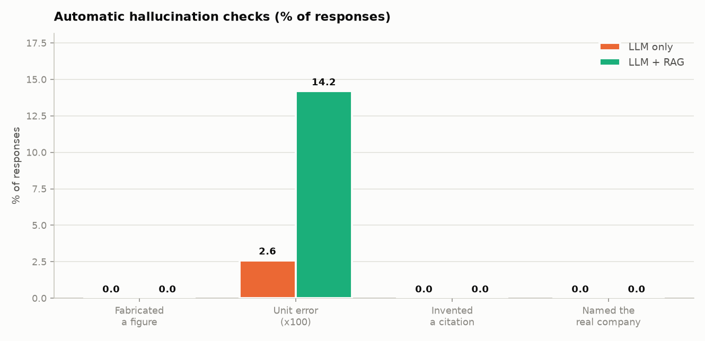

Neither arm fabricated a figure or invented a citation, so there was almost no hallucination for retrieval to remove. The one failure that did appear — restating a number at the wrong scale, e.g. `-0.1457` for `-14.57%` — got **worse** with retrieval. More context meant more numbers to keep straight.

---

## 8. Stability under identical input

The identical prompt sent 5 times at temperature 0, on 30 cases. This is how a deterministic system and a non-deterministic one can be compared fairly at all.

| System | Answer changed on identical input | Mean sd of p(up) | Mean agreement | Notes |
| --- | --- | --- | --- | --- |
| ML only (LSTM) | 0.0% | 0.0000 | 1.0000 | deterministic by construction |
| LLM + RAG | 3.33% | 0.0079 | 0.9867 | shock 6.67%, calm 0.0% |
| Hybrid | 3.33% | 0.004 | 0.9867 | moves 0.505x as much as the LLM |

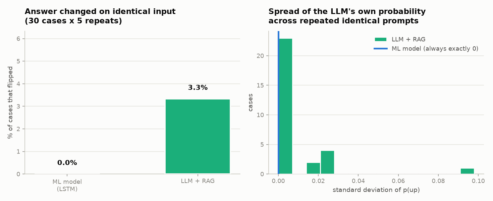

### The hybrid halves the movement but does not inherit determinism

The Hybrid's probability moves **0.505x** as much as the LLM's across identical prompts — close to the weight sitting on the ML half, which is what the arithmetic predicts. But its **direction** flip rate is identical at 3.33%, and it flipped on the same cases the LLM did (`flipped_where_llm_did_not: 0`).

**Blending damps the size of a disagreement, not the fact of one.** Halving the movement does not help when a case already sits on the decision boundary — which is precisely where a flip happens. The hypothesis that the hybrid would inherit the ML arm's stability is therefore **supported on variance and not supported on determinism**, and that was only visible because it was measured rather than inferred from the fact that half the hybrid is a fixed function.

---

## 9. Response quality as a trading assistant

Direction accuracy asks whether the call was right. For an assistant that is not the whole question — and on this task it is barely answerable at all. A user consumes an *answer*: a direction, a reason, evidence, and advice shaped to their risk appetite. Two systems can be equally accurate and differ enormously in whether that answer can be trusted, checked, or acted on, and for a trading assistant a confident, unverifiable, unhedged answer is the expensive failure — not a coin flip that landed badly.

Scored mechanically over the same 300 holdout cases. No human rates anything and no LLM judges anything: an LLM judge would import the very non-determinism §8 measures, and would not reproduce. The weights are fixed in section 10 of `research.ipynb` on the argument written beside each rule.

| System | Grounding /30 | Personalisation /25 | Helpfulness /25 | Safety /20 | Total /100 |
| --- | --- | --- | --- | --- | --- |
| Hybrid (ML + RAG-LLM) | 24.8 | 16.95 | 22.94 | 13.33 | **78.0** |
| LLM + RAG (grounded) | 24.8 | 18.47 | 22.94 | 11.0 | **77.2** |
| LLM only (no evidence) | 22.9 | 17.11 | 18.88 | 11.0 | **69.9** |
| ML only (LSTM) | 23.0 | 10.39 | 7.0 | 11.0 | **51.4** |

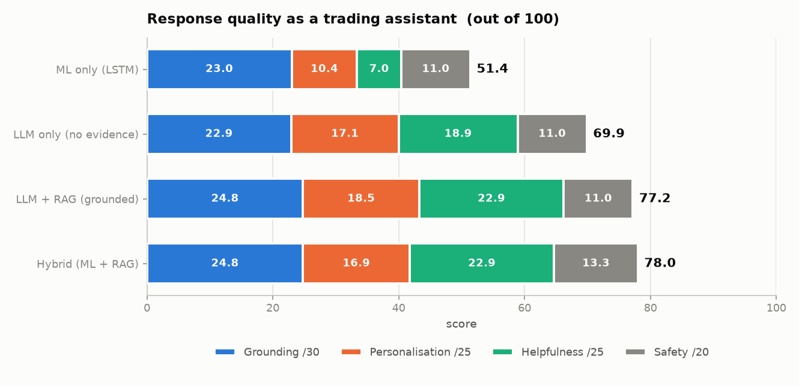

### How to read this honestly

**Hybrid (ML + RAG-LLM) scores highest at 78.0, but only 0.8 points clear of LLM + RAG (grounded).** That near-tie is not noise — it is structural, and it is the finding:

- On **grounding and helpfulness the two are identical to two decimal places**, because the Hybrid's answer text *is* the grounded arm's answer text. It inherits the reasoning and the evidence wholesale, so it cannot differ.
- The Hybrid gains on **safety** (better calibrated confidence, and it is the only arm that can tell a user its two components disagreed).
- The Hybrid *loses* on **personalisation**, because pooling concentrates its confidence into a narrower band, so the risk profiles separate its advice less often than they separate the grounded LLM's.

**Retrieval is where response quality comes from; fusion adds calibration and disagreement-reporting, worth about a point.** The large gaps are elsewhere: grounding lifts the LLM from 69.9 to 77.2, and the LSTM scores 51.4 because a bare number cannot explain, attribute, or be checked.

### The sub-scores, including the ones that separate nothing

**42.0 of the 100 points are earned identically by all four arms.** Those rules are worth keeping — a trading assistant *should* be penalised for fabricating figures, and reporting that none of the four ever did is a result — but they inflate every total equally. The differences between systems, not the totals, are what carry information.

| Sub-score | Hybrid | LLM+RAG | LLM | ML | Separates arms? |
| --- | --- | --- | --- | --- | --- |
| `G1_no_fabricated_figures` | 10.00 | 10.00 | 10.00 | 10.00 | **no — all four identical** |
| `G2_no_invented_citations` | 8.00 | 8.00 | 8.00 | 8.00 | **no — all four identical** |
| `G3_attributes_to_evidence` | 2.45 | 2.45 | 0.00 | 0.00 | yes |
| `G4_no_unit_errors` | 4.35 | 4.35 | 4.90 | 5.00 | yes |
| `P1_produces_advice` | 6.00 | 6.00 | 6.00 | 6.00 | **no — all four identical** |
| `P2_advice_varies_by_profile` | 3.08 | 4.60 | 5.53 | 4.39 | yes |
| `P3_situational_awareness` | 2.87 | 2.87 | 0.58 | 0.00 | yes |
| `P4_explains_itself` | 5.00 | 5.00 | 5.00 | 0.00 | yes |
| `H1_clear_answer` | 7.00 | 7.00 | 7.00 | 7.00 | **no — all four identical** |
| `H2_gives_reasoning` | 6.00 | 6.00 | 6.00 | 0.00 | yes |
| `H3_cites_figures` | 5.82 | 5.82 | 5.88 | 0.00 | yes |
| `H4_checkable_evidence` | 4.12 | 4.12 | 0.00 | 0.00 | yes |
| `S1_confidence_is_calibrated` | 0.53 | 0.00 | 0.00 | 0.00 | yes |
| `S2_not_overconfident` | 5.00 | 5.00 | 5.00 | 5.00 | **no — all four identical** |
| `S3_can_decline_to_act` | 4.00 | 4.00 | 4.00 | 4.00 | **no — all four identical** |
| `S4_surfaces_disagreement` | 1.80 | 0.00 | 0.00 | 0.00 | yes |
| `S5_no_absolutist_language` | 2.00 | 2.00 | 2.00 | 2.00 | **no — all four identical** |

Two scoring decisions worth stating, because both change the answer:

1. **Text-quality rules are scored on model-generated text only**, never on the deterministic fusion sentence. An earlier version scored the whole response, and the Hybrid took full marks for situational awareness purely because that template contains the word "market" — which graded this repository's prose rather than the system. It scored 86.2 that way, against 78.0 here.
2. **A silent system is not penalised for what it cannot say.** The LSTM earns full marks for never fabricating a figure or using absolutist language, having produced no text. It loses those points instead on attribution, explanation and evidence, which is where the absence actually costs the user.

---

## 10. The fusion, and where its parameters came from

| Parameter | Value |
| --- | --- |
| Fusion method | calibrated_logit_pool_v2 |
| Shrinkage towards an equal blend | 0.5 |
| Weight on the LLM, calm markets | 0.492 |
| Weight on the LLM, shock markets | 0.487 |
| Decision threshold, Hybrid (ML + RAG-LLM) | 0.5 (not fitted — both inputs are already centred) |
| Decision threshold, LLM + RAG (grounded) | 0.6 |
| Decision threshold, LLM only (no evidence) | 0.6 |
| Decision threshold, ML only (LSTM) | 0.59 |

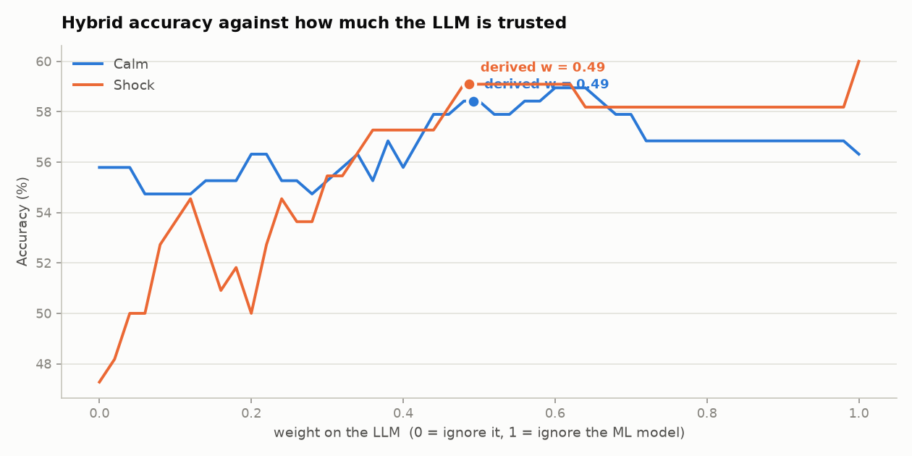

Each arm is re-expressed as a signed distance from **its own** decision point in log-odds before the two are pooled, because the arms' raw probabilities are not on the same scale. Both inputs are therefore already centred, so the Hybrid decides at 0.5 by construction — **one fitted parameter fewer than any arm it is compared against**. The weight is derived per regime from each arm's log-loss on the tuning split and shrunk halfway towards an equal blend; the curve above is flat near the middle, which is what justifies the shrinkage.

---

## 11. Where the arms agree

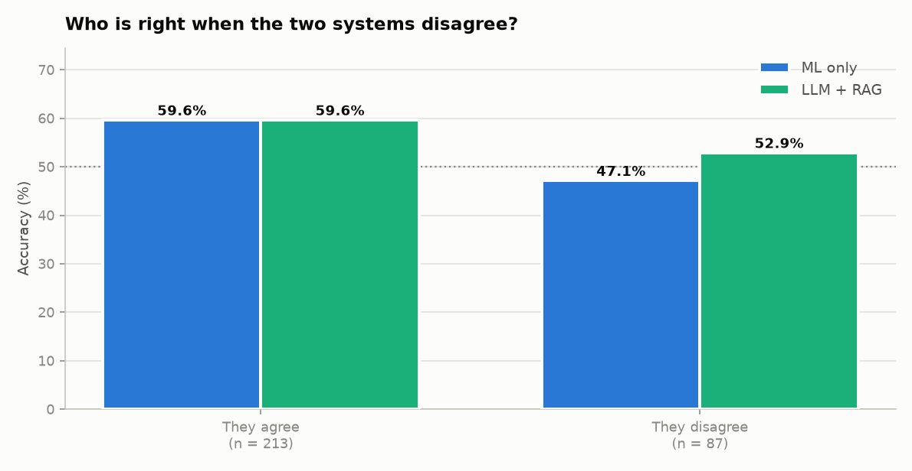

Averages hide the interesting cases. When the ML arm and the grounded LLM agree the Hybrid can only follow, so all of the fusion's value has to come from the disagreements.

---

## 12. What is in this folder

| File | What it is |
| --- | --- |
| `results.json` | Every reported number, machine readable |
| `hybrid_weights.json` | The derived fusion weights and per-arm thresholds |
| `backtest_predictions.csv` | One row per (date, stock): every arm's probability and call |
| `llm_responses.csv` | All 1,000 LLM responses with their audit verdicts |
| `stability.csv` | The repeated-prompt runs behind the stability table |
| `ml_predictions.csv` | The LSTM's walk-forward out-of-sample predictions |
| `response_scores.csv` | Every scored response behind the rubric in section 9 |
| `eda_summary.csv` | Per-stock descriptive statistics behind section 2 |
| `model_comparison.csv` | The model-selection table in section 3 |
| `model_comparison_predictions.csv` | Every candidate model's walk-forward predictions |
| `model_selection.json` | Which model was selected, and on what criterion |
| `eda1_price_trends.png` | Price history of the five stocks, indexed to 100 |
| `eda2_returns_dist.png` | Daily return distributions, one panel per stock |
| `eda3_correlation.png` | Correlation of price levels and of daily returns |
| `eda4_volatility.png` | Rolling volatility, and the VIX days labelled SHOCK |
| `eda5_returns_box.png` | Daily return spread and tails, by stock |
| `eda6_volume.png` | Average daily trading volume, by stock |
| `eda7_candlestick.png` | Price action around the most volatile day in the period |
| `eda8_regime_balance.png` | How often the price rose 5 days later, by stock and regime |
| `model1_comparison.png` | Classical ML against deep learning on identical folds |
| `model2_by_stock.png` | Model accuracy broken down by stock |
| `fig1_accuracy.png` | Direction accuracy by regime, against the always-UP baseline |
| `fig2_hallucination.png` | The three mechanical hallucination checks, per arm |
| `fig3_stability.png` | Spread of the LLM's own probability across identical prompts |
| `fig4_weight_search.png` | Hybrid accuracy against how much the LLM is trusted |
| `fig5_agreement.png` | Where the arms agree and disagree |
| `fig6_response_quality.png` | Response quality as a trading assistant, by dimension |
| `fig7_ladder.png` | The four arms on both measures, with what each layer added |
| `ceiling.json` | The bounds in §5, machine readable |

### Reproducing every number here

Run `research.ipynb` top to bottom. With the three `RUN_*` flags at their defaults it re-derives
every table and redraws every figure here from the predictions already on disk, in under a minute
and without calling the API:

```python
RUN_TRAINING   = False   # section 4  - retrain the LSTM walk-forward
RUN_COMPARISON = False   # section 2  - retrain all five candidate models
RUN_BACKTEST   = False   # section 7  - run all four arms, rewrite outputs/results.json
```

Every LLM response is cached in `data/cache/llm_cache.json`, so a re-run reproduces these numbers exactly without calling the API again.
